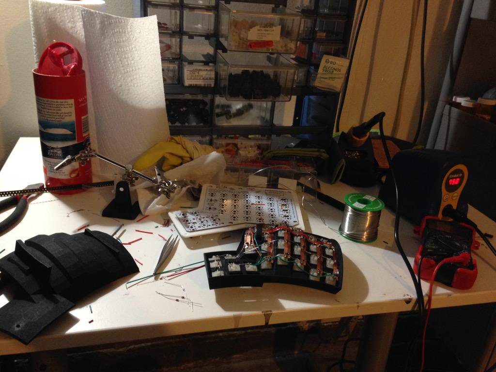
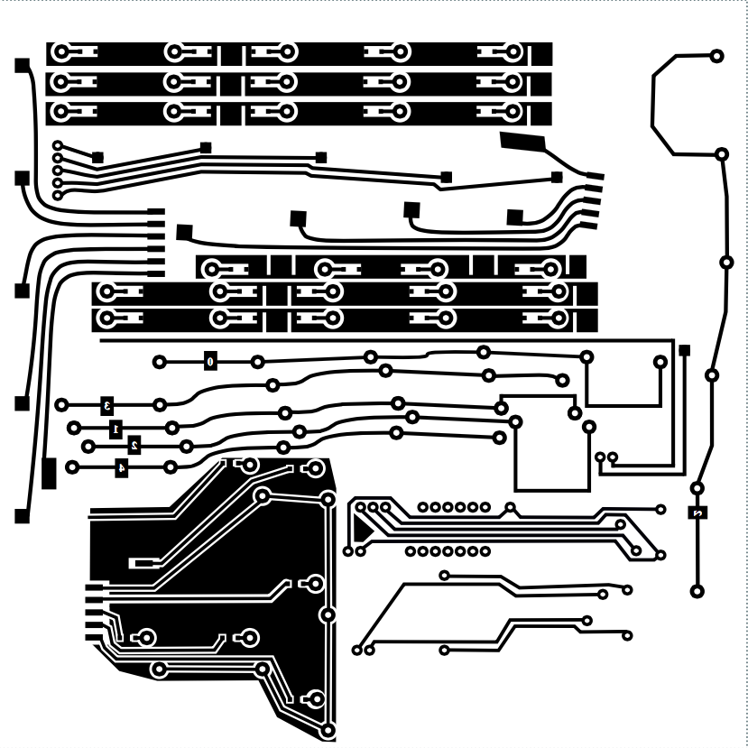
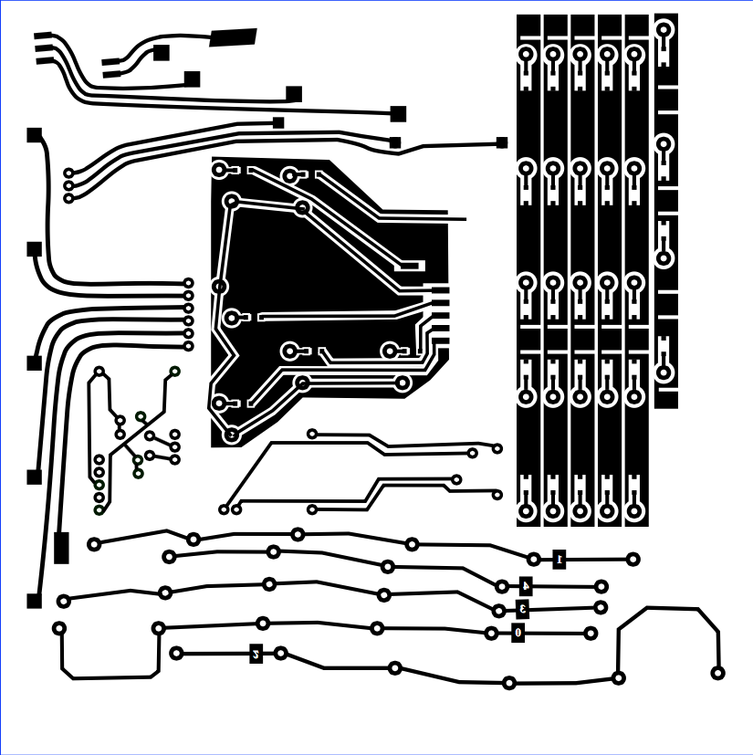
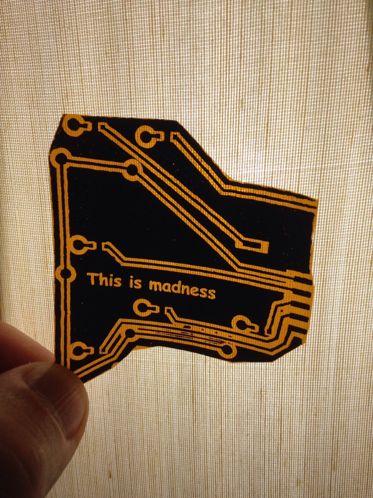
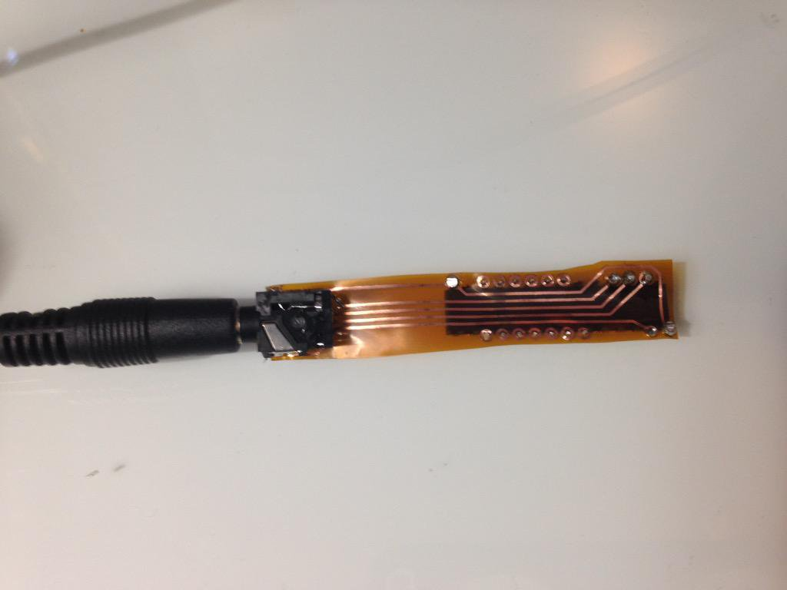
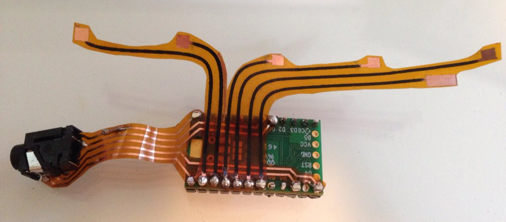
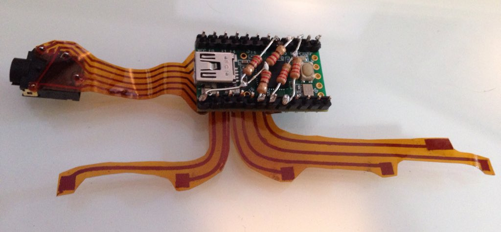
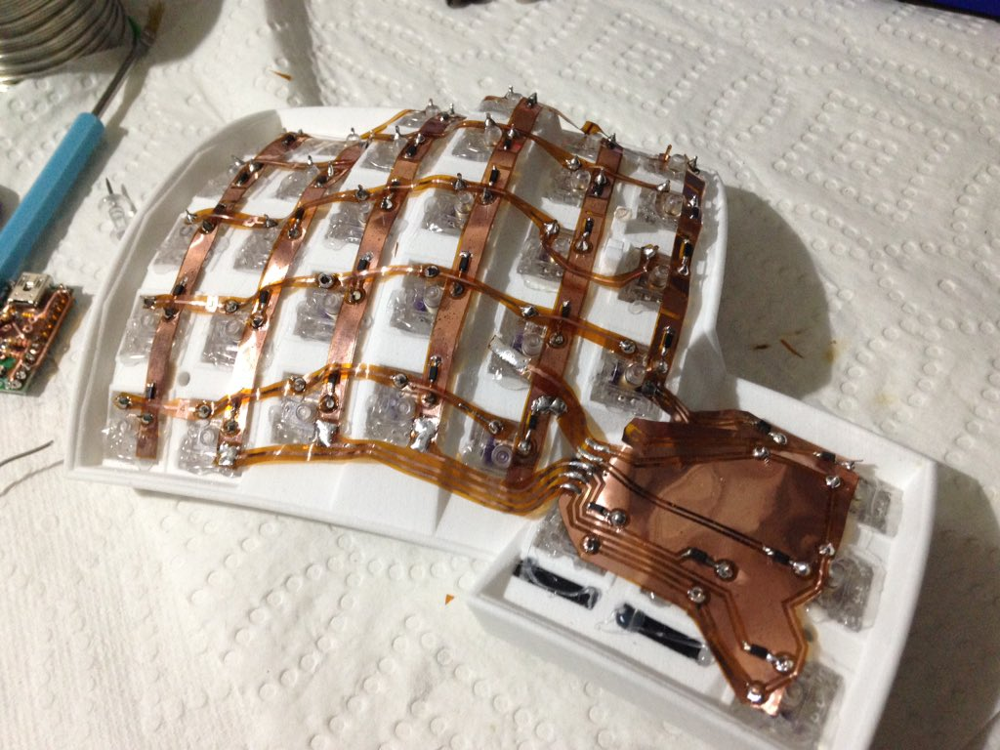
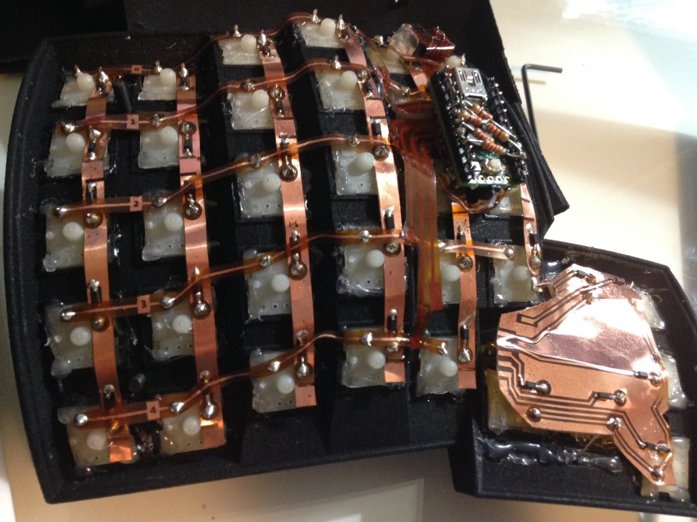
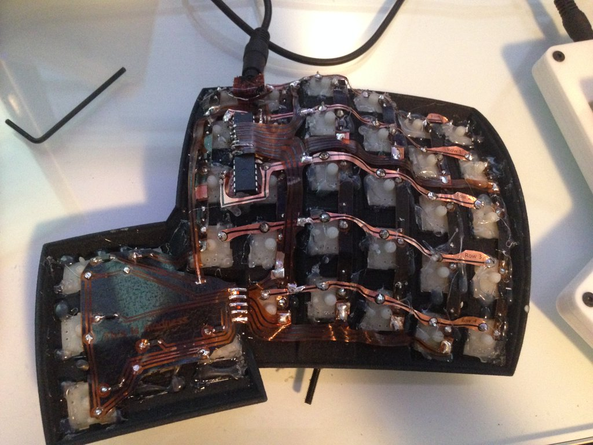

# Dactyl Flexible PCB Rough Guide

For now, take a look at the images and try to figure things out, I know that's not great (it's better than nothing!)

## Making the PCB

Get two sheets of 6in square Pyralux™.  Use the Toner Transfer
method to etch the Pyralux sheets as you would a usual PCB

> NOTE: If you only have an Inkjet make photocopies of the print out, voilà Toner based copies!

[Here's a handy toner transfer guide ... ](http://www.instructables.com/id/Toner-transfer-no-soak-high-quality-double-sided/)

Print these PCB designs out...

Left hand:

Right hand:

When you're done etching, you'll need to carefully cut the pcb into
pieces... See the images below.

## This is Madness...

The thumb cluster pcb for the left hand:

Solder the MCP like so:

Solder the Teensy 2.0 like so:

Some interesting pull up 10k resistor business here... (TODO add a small diagram and notes)

Each hand of the keyboard will wire up like so:

Teensy goes here... note the rows soldered to the teensy via the Pyralux:

Here the left hand:

That's all for now, this guide will improve over time! (TODO!)
