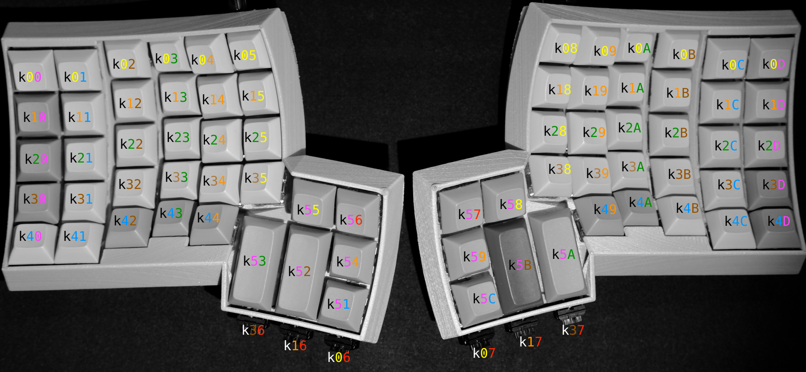
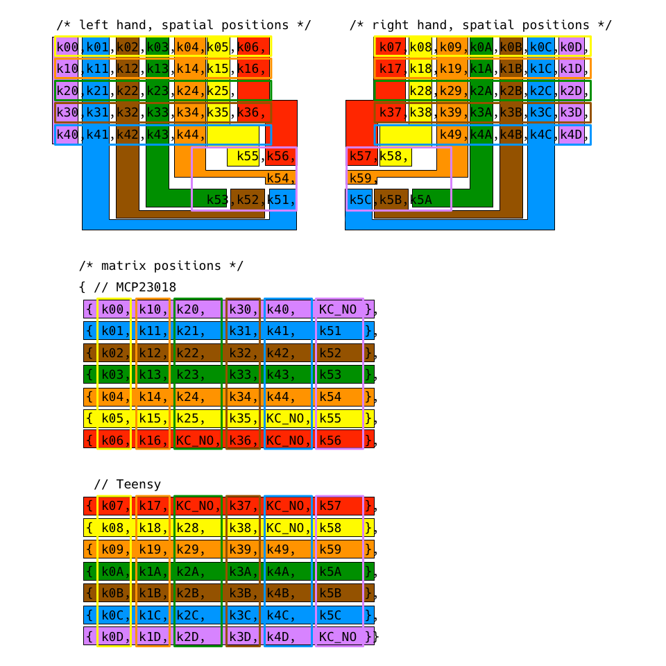
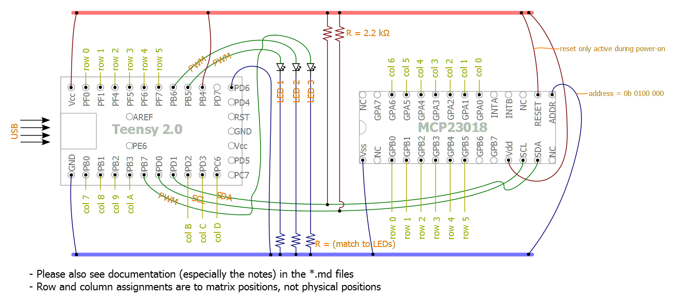
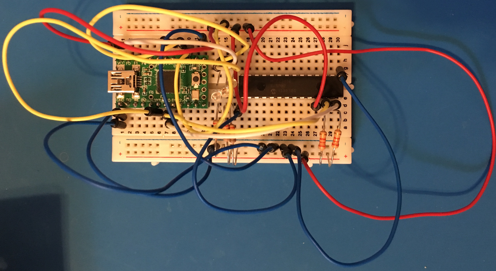
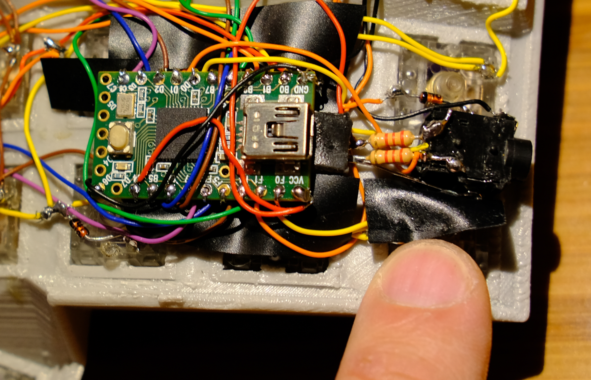
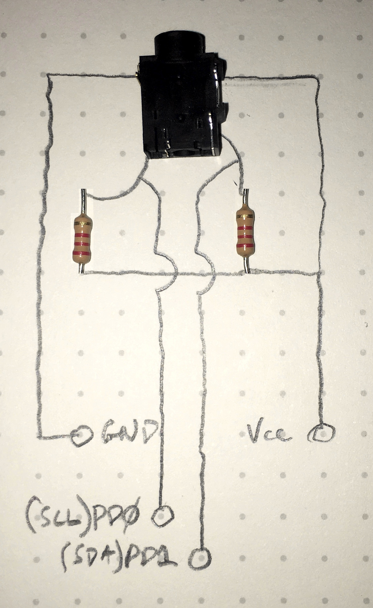
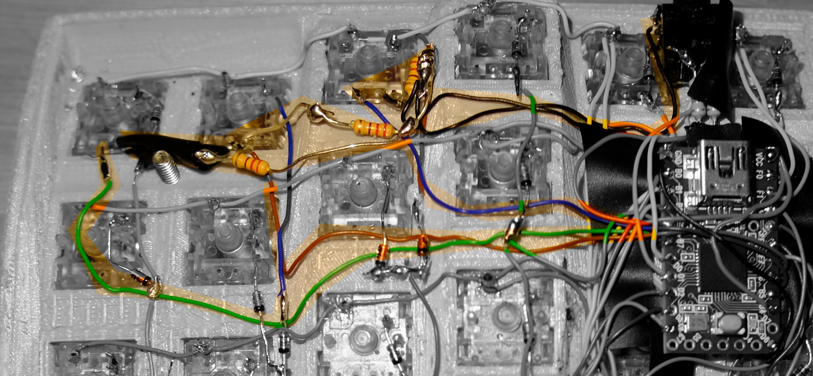
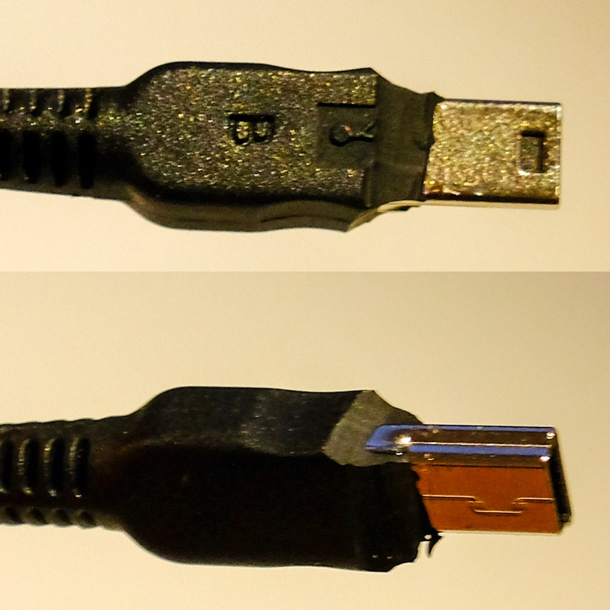
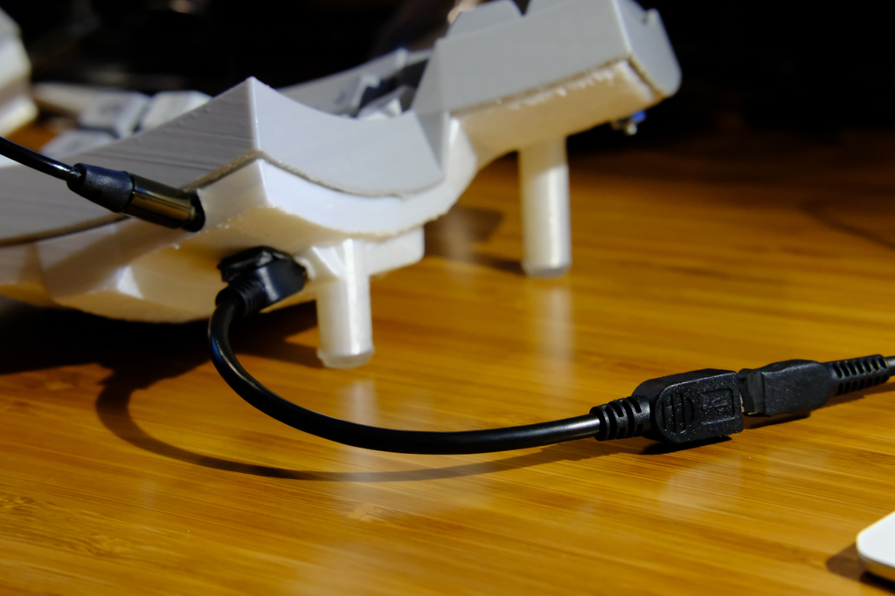

# The EZ Way to QMK

Do you love your Kinesis Advantage, but also love your Ergodox-EZ? Now you can
have the best of both worlds with your very own QMK running Dactyl! Feels like a
Kinesis, works like an Ergodox-EZ.

I found this [Massdrop guide](massdrop-ergodox-build-guide.pdf) that shipped with their original
Ergodox to be very helpful.

## Shopping List

### Things you'll have to find yourself:

* Case
* 70x Cherry MX compatible Switches
* 6x Cherry ML switches (optional)


### Things you can order from Digikey

#### An aside on LEDs

Before you place this order, you'll need to figure out what color you want your
LEDs to be, or if you even want LEDs at all.

I had a terrible time figuring out how to figure out which resistor to use with
each LED. All I can attest to is that
[These Orange LEDs](http://www.maxkeyboard.com/max-keyboard-orange-3mm-flangeless-replacement-led-for-backlit-mechanical-keyboard-10-pcs.html)
work with
[These 220Ω resistors](http://www.digikey.com/scripts/DkSearch/dksus.dll?Detail&itemSeq=229354283&uq=636318134508631803)
or at least have yet to fail in my Dactyl.

I was hoping that I could find these LEDs on Digikey for you, but they don't
have ones with the exact specs and I don't know if that breaks the compatibility
with the resistors I found.

Here's
[the evil mad scientist's guide](http://www.evilmadscientist.com/2012/resistors-for-leds/)
to choosing resistors for LEDs, but every time I did the math, it didn't work
out.

Seriously, find someone who knows more about this if you're making decisions
here. You're probably already more qualified than me, so open a PR and fix this
session.

* 70x [1N4148 Diodes](http://www.digikey.com/scripts/DkSearch/dksus.dll?Detail&itemSeq=229354375&uq=636318149504319926)
* 2x [2.2kΩ Pull up Resistors](https://www.digikey.com/product-detail/en/CFR-25JB-52-2K2/2.2KQBK-ND/666)
* 2x [TRRS Jacks](http://www.digikey.com/scripts/DkSearch/dksus.dll?Detail&itemSeq=229354247&uq=636318148338283334)
* 1 [Teensy 2.0](https://www.digikey.com/product-detail/en/adafruit-industries-llc/199/1528-1993-ND/6827126)
* 1 [MCP23018 I/O Expander](https://www.digikey.com/product-detail/en/microchip-technology/MCP23018-E-SP/MCP23018-E-SP-ND/1999505)
* [28 Pin IC Socket](http://www.digikey.com/scripts/DkSearch/dksus.dll?Detail&itemSeq=229356912&uq=636318143621851738)

If you want everything in this list from [Digikey](https://www.digikey.com), you
can upload [this cart](digikey-shopping-cart.csv).

### Things From Amazon

* 1x [MiniUSB Extender Cable](https://www.amazon.com/gp/product/B00B5HSA3Q)
* Solder/Electrical Tape/Twosided tape
* [30AWG wrapping wire](https://www.amazon.com/gp/product/B00GWFECWO)
* TRRS Cable [this one](https://www.amazon.com/Coiled-3-5mm-Jack-Audio-Cable/dp/B019TRW4HQ)
  worked for me, but it's a matter of taste and how much distance you need.

## Load QMK on your Teensy

Plug your teensy into a USB port and head over to
[QMK's Ergodox Directory](https://github.com/qmk/qmk_firmware/tree/master/keyboards/ergodox)
and build the default firmware.

```shell
make default
teensy_loader_cli -mmcu=atmega32u4 -v -w ../../ergodox_ez_default.hex
```

`-w` is now waiting for you to hit the reset button, and when you do, it'll
flash the firmware. Now you'll be able to test it as soon as you're done wiring
the right half.

## Wiring up the Matrix

The firmware you choose will determine the wiring of the keyboard. Since the
Ergodox-EZ isn't going anywhere **AND** has first class support in QMK by its
creator, it makes pretty good sense to wire it up the same way.

Here's what the matrix code for the Ergodox-EZ in QMK looks like:

```c
// matrix positions
{   // MCP23018
 { k00, k10, k20,   k30, k40,   KC_NO },                     \
 { k01, k11, k21,   k31, k41,   k51   },                     \
 { k02, k12, k22,   k32, k42,   k52   },                     \
 { k03, k13, k23,   k33, k43,   k53   },                     \
 { k04, k14, k24,   k34, k44,   k54   },                     \
 { k05, k15, k25,   k35, KC_NO, k55   },                     \
 { k06, k16, KC_NO, k36, KC_NO, k56   },                     \
    // Teensy
 { k07, k17, KC_NO, k37, KC_NO, k57   },                     \
 { k08, k18, k28,   k38, KC_NO, k58   },                     \
 { k09, k19, k29,   k39, k49,   k59   },                     \
 { k0A, k1A, k2A,   k3A, k4A,   k5A   },                     \
 { k0B, k1B, k2B,   k3B, k4B,   k5B   },                     \
 { k0C, k1C, k2C,   k3C, k4C,   k5C   },                     \
 { k0D, k1D, k2D,   k3D, k4D,   KC_NO }                      \
}
```

This is a software mapping of 14 rows, even though the physical layout will wind
up with 14 columns. Physically, it looks like this:



Look at those colors, they'll be consistent throughout this documentation,
including the physical wire we wire it up with.

Here's what it looks like with row as outlined boxes and columns as solid ones.


### Rows

You don't have to decide how to connect the rows to the Teensy or MCP yet. Just
worry about getting the matrix right.

Wiring rows 0-4 is easy. With the 30AWG wire, I had to cut individual wire
segments from switch to switch. The thumb clusters are Row 5 on each side, so
the same approach will work, it just doesn't look like a row.

Row 5 is the thumb cluster, so just wire them together and imagine they're in a
row instead of it being more like a circle.

The rows are just wire. Individual segments connecting two switches. I used a
pair of pointy tweezers to put little hooks on the end of each segment. The idea
is to let the Solder do most of the work. If a day ever comes where you have to
desolder one of these, you'll be glad you didn't aggressively wrap it.

### Columns

The columns need to be wired with diodes. You can probably wire the entire
column with the diode stems, but I chose to add some wire segments so it would
look clearer for this guide.


The diodes need the black bar facing away from the key. The other guides
disagree, but they don't use QMK.

To use wire segments here, I soldered the end of the diode with the black bar to
the wire first, then placed the other stem on the switch, positioned the diode
where I wanted it and then bet the diode stem into a hook around the switch
terminal.

I also made a habit of keeping the trimmed diode stems to use as bridges if
needed later.

**Note:** Column 6 only has one key at this point.

### Ergodox Compatibility Inner Columns

**This is an optional step, and can be done as a mod after you're done** so
there's no pressure to make this decision now.

Ergodoxes have an additional three keys in columns 6 & 7. Do you want them on
your Dactyl?

I own an Ergodox-EZ as well, and want to use the same keymap for both. So I
added the extra switches below the thumb clusters as Cherry ML switches. If you
don't care about a consistent experience between a Dactyl and Ergodox, or even
if you do, it's a matter of personal preference.

Wherever you put them, they're wired into rows 0,1 and 3. Either way, you need
to wire columns 6 and 7 to the top inner most key in the thumb cluster, so
columns 6 & 7 are going to be live.

If you go with MLs, you can put them wherever you want, but be careful measuring
where the holes go, you only get one shot.

**TODO:** CherryML switch hole specs.

## The Matrix Has You

Actually, you have it! Congratulations on having gotten this far.

## Wiring The Right Half

### Wiring the Teensy

We have to start off with the obligatory wiring diagram



Notice the row numbers are different from the other guides to match the QMK
key codes we're using.

I started off by breadboarding this whole project, but I also burnt out the
teensy's bootloader.
[My misadventures wiring a Dactyl](http://joedevivo.com/2017/05/20/building-a-qmk-dactyl.html)
are a fun read if you feel like this is too hard. I've been there.

Here's the pinout mappings for the rows and columns:

| Row     | Wire Color | Teensy Pin |
|---------|------------|------------|
| 0       | Yellow     | PF0        |
| 1       | Orange     | PF1        |
| 2       | Green      | PF4        |
| 3       | Brown      | PF5        |
| 4       | Blue       | PF6        |
| 5       | Purple     | PF7        |


| Column | Wire Color | Teensy Pin |
|--------|------------|------------|
| 7      | Red        | PB0        |
| 8      | Yellow     | PB1        |
| 9      | Orange     | PB2        |
| A      | Green      | PB3        |
| B      | Brown      | PD2        |
| C      | Blue       | PD3        |
| D      | Purple     | PC6        |

Wiring the teensy involves looping the 30AWG wire through the Teensy's pinouts,
I went through twice, and then dabbed a little solder. If you are ok with
possibly wasting a little wire, you can use longer wire to solder up the Teensy
and then breadboard with those wires. There's no room for pins in the case, so
this is the best way to test it out.

Here's my breadboarded version, almost done. (missing the reset wire to the MCP
in this photo)



Yours will look similar, but with the Teensy coming from off board with a bunch
of wires. You don't have to breadboard the columns and rows for the teensy, you
can test them by clipping them to the right spot on the matrix you built.

Columns and rows run by the MCP (Greetings, program!) will be accessible via the
breadboard.

Here's what that looks like wired in.


Fortunately, QMK *will* let you just run the right half, so you can check in at
this point and see how that all works,

### The TRRS Jack

In an effort to move some of the bulk away from the Teensy, I put the pull up
resistors as close to the jack as I could.



I wired the two 2.2k resistors to the bottom two terminals on the TRRS jack,
then wired the SCL(PD0) and SDA(PD1) to the resistor leg going into the jack.
Then soldered the outside legs together and ran a wire from Vcc to those outside
legs, and from them to a third terminal on the TRRS jack. Now all you need is to
run GND to the fourth terminal.



Be careful! The GND and Vcc pins on the TRRS jack like to casually fall out as
you're working. I image this isn't a problem when using them as intended on
PCBs, but in this case, once it's soldered, a little electrical tape never hurt
anyone.

### LEDs

We talked about choosing them before, but here's how to wire them. You can make
them all do what you want in your QMK keymap at will.

I put them in the top rightmost MX switches, but I'd love to find a place to
incorporate them directly in the case.

Here's what that looked like:


And with a cap:


I did my best here to try and isolate the Green, Brown and Blue wires heading
from the Teensy to each LED, the 220Ω resistors and the Black wire to the Ground
terminal via the TRRS pin.

| LED | Wire Color | Teensy Pin |
|-----|------------|------------|
| 1   | Green      | PB5        |
| 2   | Brown      | PB6        |
| 3   | Blue       | PB7        |



## Wiring The Left Half

I wired the left half to be a mirror image of the right, with the mirror between
the two halves. That means the rows are the same, but the column are both purple
on the outside, and red on the inside.

Here's the color coding and pin outs for the left half:

| Row     | Wire Color | MCP23018 Pin |
|---------|------------|--------------|
| 0       | Yellow     | GPB0         |
| 1       | Orange     | GPB1         |
| 2       | Green      | GPB2         |
| 3       | Brown      | GPB3         |
| 4       | Blue       | GPB4         |
| 5       | Purple     | GPB5         |

| Column | Wire Color | Teensy Pin |
|--------|------------|------------|
| 0      | Purple     | GPA6       |
| 1      | Blue       | GPA5       |
| 2      | Brown      | GPA4       |
| 3      | Green      | GPA3       |
| 4      | Orange     | GPA2       |
| 5      | Yellow     | GPA1       |
| 6      | Red        | GPA0       |

And here's the left half wired up:


The rules are pretty much the same as the right half. Black bar on the diode
facing away from the switch.

### Connecting to the MCP23018

I am really too entertained that the company that makes this microchip is called
Microchip, which got me into the habit of calling the MCP "microchip by
Microchip". The big takeaway here is that it's a microchip, and not a cool dev
board like the Teensy. What this means for you is soldering a bunch of terribly
tiny wires to terribly tiny pins.

Hand wiring microchip is incredibly frustrating. I broke a pin off my first one,
pretty much rendering it useless. Fortunately, there's an easier way.

I still wound up soldering the connections from the TRRS jack to the MCP. There
were also some pins that I connected with short wires.

* Vss -> ADDR -> TRRS
* RESET -> Vdd -> TRRS
* SCL -> TRRS
* SDA -> TRRS

All that's left are the rows and columns. I trimmed a 28pin IC socket down to a
7pin and 6pin single row socket, and soldered the matrix to those. Then I was
able to clip them on to the right spots on the MCP.ß

Here the colums clip right on:


And the rows too: I know I labeled the rows incorrectly, I was working off the
old guide which numbers rows differently.


Once they're plugged in, I'd lock down the whole situation with some electrical tape.

The left side requires more precise work, but it's a simpler wiring job.

## Closing up the case

### Left side

The positioning of the MCP23018 doesn't really matter as long as it fits in the
notch in the case bottom. The important thing is making sure the TRRS jack is in
the right place. It takes a little trial and error with the two-sided tape, but
once it's locked down, you're good.

I used screws with the flattest heads I could find and nuts to match. Don't
over-tighten, especially on FDM printed cases. If the infill is too low, the
case bottom will just buckle.

### Right side

Placing the TRRS jack on the right side will be pretty much the same as the
left.

The top case I built with had no mounting solution for the teensy, so there was
a lot of trial and error there. The newer models have a little notch to attach
the Teensy to, which I assume will have it line up perfectly with the hole for
the Mini-USB, but I haven't tested that.

In the end, I shaved down a short USB extension cable, plugged it in to the
Teensy and double-sided taped it to the outside of the case.





One thing I did, is burn a little hole through the bottom so I have access to
the Teensy's reset button for firmware flashing.


## Done!


